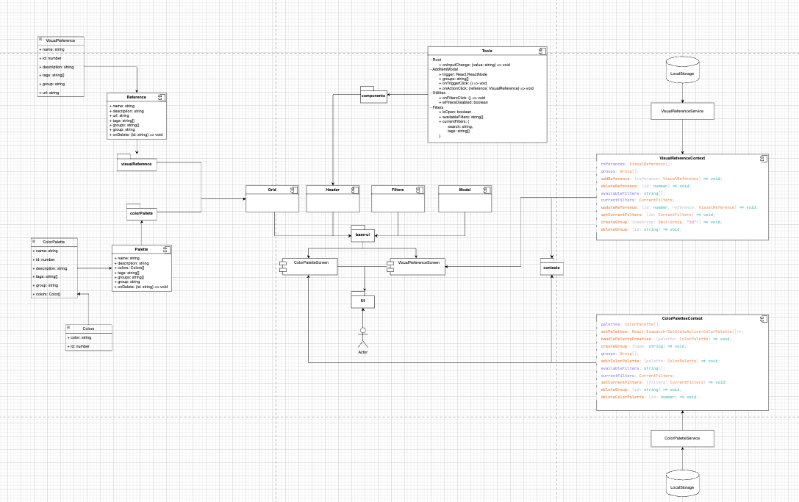

# Brand Zone MVP

Essa é um protótipo de uma aplicação de gerenciamento de marca. Construído utilizando NextJS, styled-components e Turborepo.

## Como executar a aplicação

Execute o comando\* abaixo para instalar as dependências:

```sh
pnpm install
```

Obs.: Tenha instalado o [PNPM](https://pnpm.io/pt/).

Após a instalação das dependências, execute o comando abaixo para iniciar a aplicação:

```sh
pnpm dev
```

A aplicação estará disponível no endereço [http://localhost:3000](http://localhost:3000) para visualização.

## Por que Turborepo?

Turborepo é uma ferramenta que facilita o gerenciamento de um monorepo. Ela permite que você execute tarefas em todos os pacotes do monorepo com um único comando. Facilitando o processo de gerenciamento de dependências e de build. Possibilitando o desenvolvimento em paralelo de pacotes externos, auxiliando a escalabilidade de projetos como um Design System, ou até mesmo uma aplicação completa separada por módulos.

### O que foi desenvolvido?

Todas as funcionalidades base requisitadas foram desenvolvidas.

#### Módulo de Imagens:

- Visualização de imagens em grid
- Adição de novas imagens (via URL ou API simulada)
- Organização em grupos personalizados
- Atribuição de tags às imagens
- Adição e edição de comentários em cada imagem
- Exclusão de imagens

#### Módulo de Paleta de Cores:

- Visualização de paletas de cores salvas
- Criação de novas paletas (conjunto de cores)
- Organização em grupos personalizados
- Atribuição de tags às paletas
- Adição e edição de comentários em cada paleta
- Exclusão de paletas

#### Organização:

- Criação e gerenciamento de grupos
- Criação e gerenciamento de tags
- Filtragem de conteúdo por grupo ou tag
- Pesquisa por nome, comentário ou tag

### Arquitetura

A arquitetura do projeto pode ser encontrada no arquivo [BrandStudioMVP.drawio](./docs/BrandStudioMVP.drawio). Para ser visualizada, basta abrir o arquivo no [Draw.io](https://draw.io).

#### Diagrama de componentes



#### Arquitetura principal


